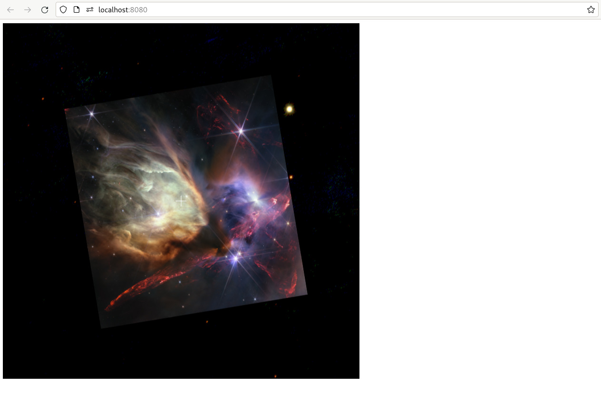

+++
title = "Loading an Image"
weight = 400
+++

Now that we’ve played with WWT’s background image, let’s load up an image in the
foreground. Edit the JavaScript code of your `index.html` file to read as
follows. Once again, changes relative to the previous section are subtly
highlighted:
```js,hl_lines=13-14 17-22
var script_interface, wwt;

function init_wwt() {
    const builder = new wwtlib.WWTControlBuilder("wwtcanvas");
    builder.startRenderLoop(true);
    script_interface = builder.create();
    script_interface.add_ready(on_ready);
}

function on_ready() {
    console.log("WWT is ready!");
    wwt = wwtlib.WWTControl.singleton;
    script_interface.add_collectionLoaded(on_wtml_loaded);
    script_interface.loadImageCollection("https://data1.wwtassets.org/packages/2023/07_jwst/weic2316a/index.wtml");
}

function on_wtml_loaded() {
    wwt.setForegroundImageByName("Rho Ophiuchi cloud complex");
    script_interface.setForegroundOpacity(100);
    script_interface.add_arrived(on_arrived);
    wwt.gotoRADecZoom(16.442, -24.385, 1.06, false);
}

function on_arrived() {
    wwt.setBackgroundImageByName("PanSTARRS");
}

window.addEventListener("load", init_wwt);
```

When you reload your app, you should see WWT zoom in on and load up [a lovely
JWST image][weic2316a] of ρ Oph:

[weic2316a]: https://esawebb.org/images/weic2316a/



Here, the API function
{{engineapi(p="classes/ScriptInterface.html#loadImageCollection",t="ScriptInterface.loadImageCollection()")}}
allows us to extend WWT’s built-in corpus of data with additional data sets. We
register a callback with
{{engineapi(p="classes/ScriptInterface.html#add_collectionLoaded",t="ScriptInterface.add_collectionLoaded()")}}
to get notified when the information has been downloaded, at which point we can
tell the engine to change the foreground to the new image that it has just
learned about.

<div class="callout callout-note">

Try changing the opacity setting to, say, 50, to transparently blend the
foreground on top of the background.

</div>

If you load up the URL used here,

> <https://data1.wwtassets.org/packages/2023/07_jwst/weic2316a/index.wtml>

you will see that it is another [WTML collection][wtml], which is stored in
[XML] format. That WTML file, in turn, points at the actual imagery data, which
have been processed into WWT’s cloud-friendly tiled formats. This two-step
approach is an important element of WWT’s data model: while the actual data
files that WWT displays might be large and slow to download, the WTML files that
tell the engine *about* data are small and efficient.

[wtml]: https://docs.worldwidetelescope.org/data-guide/1/data-file-formats/collections/
[XML]: https://en.wikipedia.org/wiki/XML

<div class="callout callout-note">

Once again, other coding models provide slightly more sophisticated interfaces.
The
{{helpersapi(p="classes/WWTInstance.html#loadImageCollection",t="WWTInstance.loadImageCollection()")}}
and
{{piniaapi(p="functions/engineStore.html#loadImageCollection",t="engineStore().loadImageCollection()")}}
APIs return promises that resolve to
{{engineapi(p="classes/Folder.html",t="Folder")}} objects, which provide direct
access to the information retrieved from the WTML URL.

</div>


# Getting Data into WWT

These examples are suggesting that WTML files are pretty important to WWT.
Indeed, they are. The WWT project includes a lot of support tooling to help you
manage them:

- The [toasty] Python library and CLI tool provide lots of tools for importing
  images into WWT’s formats, including producing appropriate WTML metadata
- The [wwt_data_formats] Python library and associated `wwtdatatool` CLI program
  provide some lower-level tools for working with various WWT data and file
  formats, including WTML files.

See also the [WWT Data Guide].

[toasty]: https://toasty.readthedocs.io/
[wwt_data_formats]: https://wwt-data-formats.readthedocs.io/
[WWT Data Guide]: https://docs.worldwidetelescope.org/data-guide/1/


# Callback Hell

You might note that we’re piling up a lot of callbacks here. We sure are!
There’s a reason that web developers talk about [callback
hell](http://callbackhell.com) — this style of programming rapidly becomes very
hard to scale and maintain. **This is why we strongly recommend avoiding plain
JavaScript when building complex WWT apps.** More sophisticated models like the
[Vue component model](@/getting-started/vue-component-model.md), or even the
[TypeScript model](@/getting-started/bundled-typescript-model.md) with `async`
syntax, take a bit more effort to learn, but provide much better tools for
managing the complex timing concerns of modern web apps.
