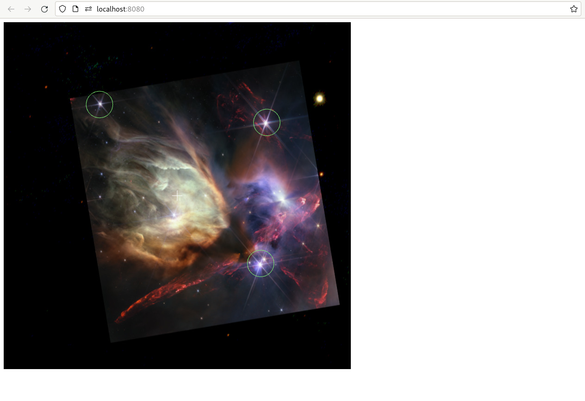
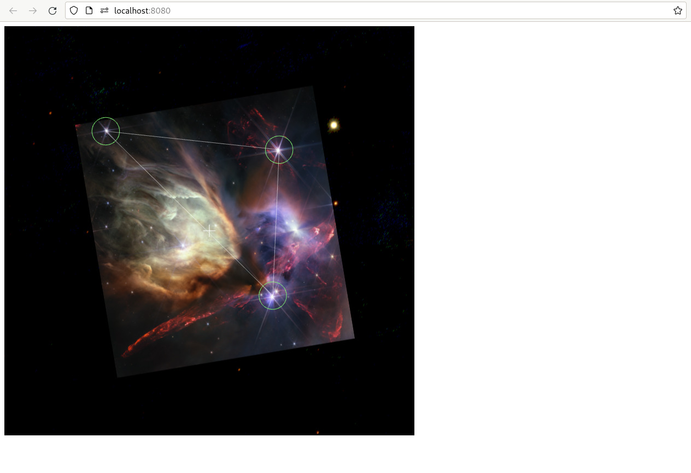

+++
title = "Adding Annotations"
weight = 500
+++

We’ll continue our exploration of the WWT API by considering annotations:
geometrical overlays that can be layered on top of the WWT view.

Update the JavaScript code of your `index.html` file to add the following
changes:

```js,hl_lines=22 29-43
var script_interface, wwt;

function init_wwt() {
    const builder = new wwtlib.WWTControlBuilder("wwtcanvas");
    builder.startRenderLoop(true);
    script_interface = builder.create();
    script_interface.add_ready(on_ready);
}

function on_ready() {
    console.log("WWT is ready!");
    wwt = wwtlib.WWTControl.singleton;
    script_interface.add_collectionLoaded(on_wtml_loaded);
    script_interface.loadImageCollection("https://data1.wwtassets.org/packages/2023/07_jwst/weic2316a/index.wtml");
}

function on_wtml_loaded() {
    wwt.setForegroundImageByName("Rho Ophiuchi cloud complex");
    script_interface.setForegroundOpacity(100);
    script_interface.add_arrived(on_arrived);
    wwt.gotoRADecZoom(16.442, -24.385, 1.06, false);
    add_annotations();
}

function on_arrived() {
    wwt.setBackgroundImageByName("PanSTARRS");
}

const centers = [ // RA and Dec in degrees
    [246.597, -24.350],
    [246.679, -24.342],
    [246.600, -24.413],
];

function add_annotations() {
    for (var i = 0; i < centers.length; i++) {
        const c = new wwtlib.Circle();
        c.setCenter(centers[i][0], centers[i][1]);
        c.set_radius(0.005);
        c.set_lineColor("#7ced72");
        script_interface.addAnnotation(c);
    }
}

window.addEventListener("load", init_wwt);
</script>
```

Hopefully, this new code should seem fairly self-explanatory. The
{{engineapi(p="classes/Circle.html",t="Circle")}} class is a fairly
straightforward object representing a circular annotation, and the
{{engineapi(p="classes/ScriptInterface.html#addAnnotation",t="ScriptInterface.addAnnotation()")}}
API registers the annotation so that the engine will draw it. There are
{{engineapi(p="classes/ScriptInterface.html#removeAnnotation",t="removeAnnotation()")}}
and
{{engineapi(p="classes/ScriptInterface.html#clearAnnotations",t="clearAnnotations()")}}
APIs that allow annotations to be removed if no longer needed. In this mode, the
circle radius is specified in degrees.



<div class="callout callout-note">

You guessed it — you can add an annotation in the [Vue/Pinia
model](@/getting-started/vue-component-model.md) using an API method called
{{piniaapi(p="functions/engineStore.html#addAnnotation",t="engineStore().addAnnotation()")}}.
There is no corresponding
{{helpersapi(p="classes/WWTInstance.html",t="WWTInstance")}} method because it
would offer no “value-add” above the function that already exists on the core
{{engineapi(p="classes/ScriptInterface.html",t="ScriptInterface")}} — this
particular method doesn’t involve any fancy asynchronous behavior.

</div>

You can also add annotations corresponding to filled polygons, or sequences of
line segments:

```js,hl_lines=2 11 14-16
function add_annotations() {
    const pl = new wwtlib.PolyLine();

    for (var i = 0; i < centers.length; i++) {
        const c = new wwtlib.Circle();
        c.setCenter(centers[i][0], centers[i][1]);
        c.set_radius(0.005);
        c.set_lineColor("#7ced72");
        script_interface.addAnnotation(c);

        pl.addPoint(centers[i][0], centers[i][1]);
    }

    pl.addPoint(centers[0][0], centers[0][1]);
    pl.set_opacity(0.5);
    script_interface.addAnnotation(pl);
}
```



<div class="callout callout-warning">

WWT's polygon fills use an even-odd rule, which means that you must specify your
polygon points such that they are counterclockwise on the sky (East-from-North
position angle increasing). If you create a small filled polygon with clockwise
points, nothing will fill in!

</div>

If you want to render a *lot* of circles, you should probably use a
{{engineapi(p="classes/SpreadSheetLayer.html",t="“spreadsheet”")}} (data table)
layer, which can scale to rendering tens of thousands of data points. To render
a *really* big number of circles, like millions, you can use a
{{engineapi(p="classes/WWTControl-1.html#addCatalogHipsByName",t="progressive HiPS catalog")}}
layer, which will stream in catalog entries on-the-fly and render an appropriate
subset based on the current view.


# Limitations

WWT’s annotations system has a few limitations to know about.

First, there are some documented attributes that aren’t implemented,
particularly control over line widths. These were implemented in the earlier
canvas-based rendering scheme, but not in the current WebGL scheme.

For the same reason, there is currently no support for textual annotations.
[Rendering arbitrary text in WebGL is surprisingly hard!][webgl-text]
Contributions to add this functionality would be welcome.

[webgl-text]: https://webglfundamentals.org/webgl/lessons/webgl-text-html.html
