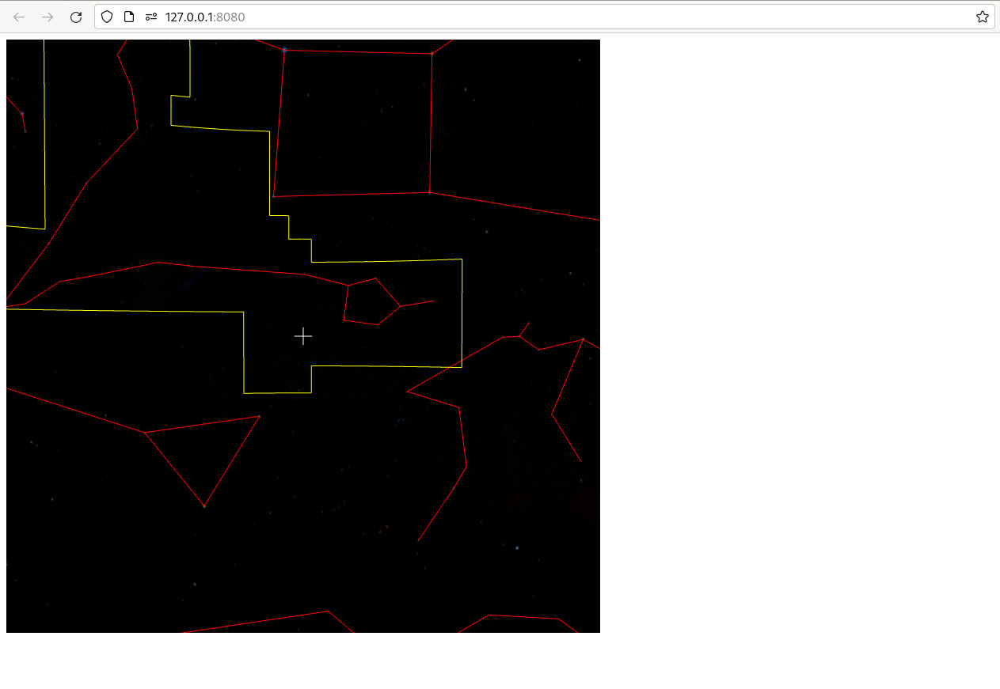
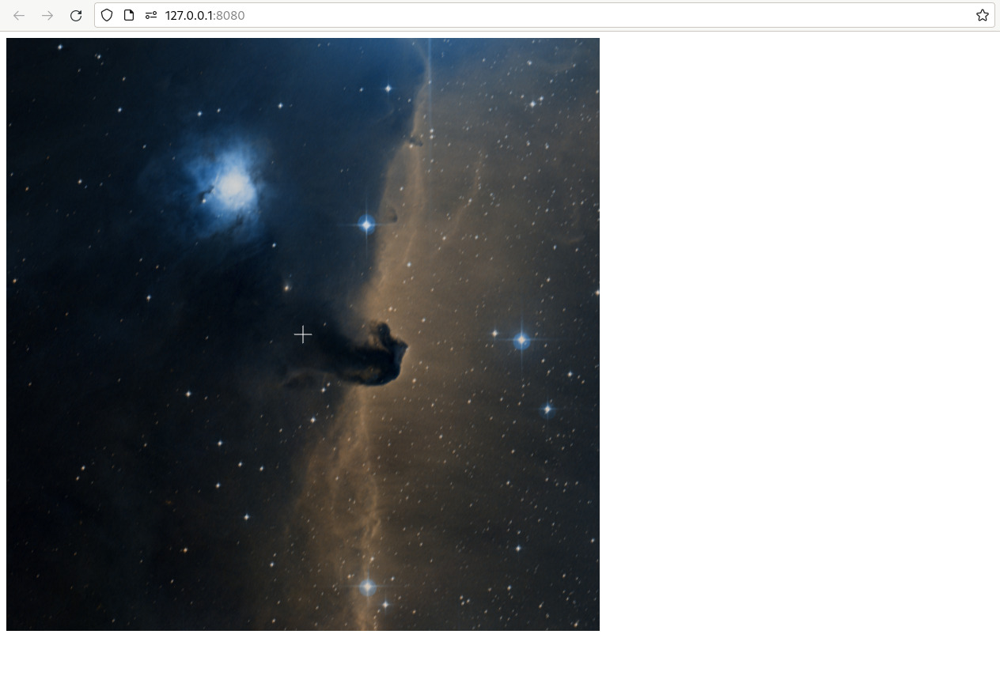

+++
title = "A Basic WWT Window"
weight = 100
+++

Let’s start by making a simple-as-possible webpage that includes WWT. For this
reason, we’ll cut out the frills and adopt the [hosted JavaScript
model](@/getting-started/hosted-javascript-model.md).

First, create a directory on your computer that you’ll use to hold files for
this tutorial. We’ll assume that it’s called `wwt-tutorial`, and that any
terminal commands are run in that directory unless specified otherwise:

```sh
$ mkdir wwt-tutorial
$ cd wwt-tutorial
```

In that directory, create a file `index.html` with the following content:

```html
<!doctype html>
<html lang="en">
<head>
    <title>My First WWT Application</title>
    <script src="https://web.wwtassets.org/engine/7/wwtsdk.js"></script>
</head>
<body>
    <div id="wwtcanvas" style="width: 750px; height: 750px; background-color: #000"></div>

    <script type="text/javascript">
        function init_wwt() {
            const builder = new wwtlib.WWTControlBuilder("wwtcanvas");
            builder.startRenderLoop(true);
            builder.create();
        }

        window.addEventListener("load", init_wwt);
    </script>
</body>
</html>
```

That’s almost all we need to get started! The only other step is to serve this
file using a local web server. You *could* open this file directly in your web
browser, so that your address bar shows a `file:///....` URL, but browsers
actually impose some surprising constraints on webpages opened this way. It
quickly becomes important to use an actual webserver for local test. [There
are literally dozens of options to do this][servers]; we recommend:

```sh
$ npx http-server
```

It’s easiest to just launch this command in a separate terminal window and
ignore it. There should be no particular need to stop and restart the command as
you’re working.

[servers]: https://gist.github.com/willurd/5720255

The `npx` command should print out a URL like `http://127.0.0.1:8080` that you
should be able to open up and get a basic WWT view that looks like this:



Not the most thrilling, but it’s a start! And even this minimal WWT window
supports a lot of interactive features. You can click and drag to pan, or use
the mouse wheel to zoom in and out. If you hold down the Control key, you can
roll the view. If you drag the map around enough, you should be able to find the
band of the Milky Way, or perhaps recognize one of your favorite constellations.
If you’re able to find Orion know where to zoom in, perhaps you can find the
[Horsehead Nebula]:



[Horsehead Nebula]: https://en.wikipedia.org/wiki/Horsehead_Nebula

Let’s go back and take a look at your HTML file. The key elements are:

1. The `<script>` tag in the `<head>` section that loads up the WWT WebGL
   engine. You interface with this library via a global variable named
   `wwtlib`.
2. A `<div>` element that becomes home for the WWT viewport.
3. A JavaScript shim that uses the
   {{engineapi(p="classes/WWTControlBuilder.html",t="WWTControlBuilder")}}
   class to initialize the engine and start it rendering.

Every WWT-based web app will include these items in some form or another.

