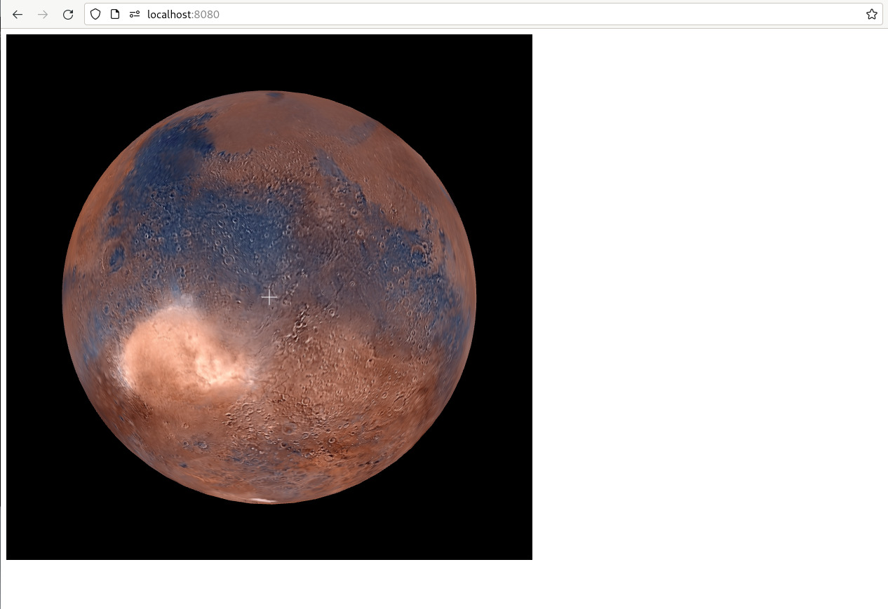
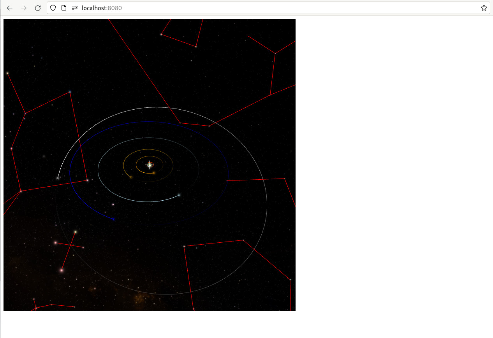

+++
title = "Changing the Background"
weight = 300
+++

Next, we’ll change the imagery that WWT is displaying. Edit the JavaScript code
of your `index.html` file to read as follows:

```js,hl_lines=13 17-19
var script_interface, wwt;

function init_wwt() {
    const builder = new wwtlib.WWTControlBuilder("wwtcanvas");
    builder.startRenderLoop(true);
    script_interface = builder.create();
    script_interface.add_ready(on_ready);
}

function on_ready() {
    console.log("WWT is ready!");
    wwt = wwtlib.WWTControl.singleton;
    script_interface.add_arrived(on_arrived);
    wwt.gotoRADecZoom(17.75, -28.9, 10, false);
}

function on_arrived() {
    wwt.setBackgroundImageByName("PanSTARRS");
}

window.addEventListener("load", init_wwt);
```

We now use
{{engineapi(p="classes/ScriptInterface.html#add_arrived",t="ScriptInterface.add_arrived()")}}
to add a callback that will be invoked when the slew of the view completes. That
callback will in turn use
{{engineapi(p="classes/WWTControl-1.html#setBackgroundImageByName",t="WWTControl.setBackgroundImageByName()")}}
to change the background image to a mosaic of [PanSTARRS
3pi](https://outerspace.stsci.edu/display/PANSTARRS/).

<div class="callout callout-note">

In other models you might use
{{helpersapi(p="classes/WWTInstance.html#setBackgroundImageByName",t="WWTInstance.setBackgroundImageByName()")}}
or
{{piniaapi(p="functions/engineStore.html#setBackgroundImageByName",t="engineStore().setBackgroundImageByName()")}}.
Instead of worrying about an `add_arrived()` callback, you’d use [async
code][async-js] to deal with sequencing actions.

[async-js]: https://developer.mozilla.org/en-US/docs/Learn/JavaScript/Asynchronous

</div>


# Tiling In Data

If you reload your app, you will probably notice a very gross and jarring flash
as the background imagery switches from the WWT default (a [DSS2] mosaic) to
PanSTARRS. This is, to a certain extent, an intentional part of this tutorial.
WWT loads data on the fly, so when you ask it to display new imagery, there will
be a period when the new data are “tiling in” — being downloaded by the browser.

[DSS2]: https://en.wikipedia.org/wiki/Digitized_Sky_Survey

There’s simply no way to avoid this. To achieve a really high-end experience,
you need to design your code around this reality. If you’re going to change
background images, for instance, try to do it when zoomed as far out as
possible. (As an experiment, try reloading your app with the `gotoRADecZoom()`
zoom setting changed from 10 to 360.) Prefer non-instant `gotoRADecZoom()` slews
to give the engine more time to fetch data as it pans to the new target. (As
another experiment, try setting the “instant” option to `true` and commenting
out the change to the PanSTARRS background — the effect is also be a bit
jarring.)


# Built-In Imagery

You might very well ask: “How does WWT know what Pan-STARRS is?” Good question!

One of the great things about WWT is that its data model is very extensible —
you can pull in data from lots of different sources, and there are hardly any
“privileged” data assets that get special treatment.

That being said, by default WWT does come preloaded with a core corpus of
imagery and other data sets. That core corpus is loaded on startup. It is
expressed as a [WTML collection][wtml] that is downloaded from the following URL:

> <http://worldwidetelescope.org/wwtweb/catalog.aspx?X=ImageSets6>

[wtml]: https://docs.worldwidetelescope.org/data-guide/1/data-file-formats/collections/

(There are historical reasons for this URL’s particular form.) This collection
defines roughly 100 core sky maps that can be loaded by name. Its contents are
managed in a GitHub repository called [wwt-core-catalogs].

[wwt-core-catalogs]: https://github.com/WorldWideTelescope/wwt-core-catalogs


# The Render Type

The choice of background imagery has a special role in WWT. Besides controlling
the base image that’s displayed, it also controls the engine’s “render type”:
the global exploration mode that WWT uses. The WWT WebGL engine supports five
such types.

The first is “sky mode”, as we’ve been seeing.

The second is “planet mode”. To experience this, modify your JavaScript code
to use a different background and, while we’re at it, zoom level:

```js,hl_lines=5 9
function on_ready() {
    console.log("WWT is ready!");
    script_interface.add_arrived(on_arrived);
    wwt = wwtlib.WWTControl.singleton;
    wwt.gotoRADecZoom(17.75, -28.9, 100, false);
}

function on_arrived() {
    wwt.setBackgroundImageByName("Visible Imagery");
}
```

Suddenly we're looking at Mars!



We’ve pulled up WWT’s default Mars map here — to maintain compatibility with old
Windows app installations, the map must be named “Visible Imagery”. Setting it
as the background causes WWT to enter planet mode, where you can pan and zoom
around a sphere from the outside — which isn’t really too different from sky
mode, where you’re navigating a sphere from the inside. Take some time to
explore Mars — it’s fun!

The third mode is “earth mode”, which for our purposes is the same as planet
mode. You can activate it with:

```js
wwt.setBackgroundImageByName("Bing Maps Aerial");
```

The fourth mode is “panorama” mode, where we go back to the inside of a sphere:

```js
wwt.setBackgroundImageByName("Curiosity 360-Degree View Approaching Mont Mercou");
```

This is largely the same as “sky mode”, but things like the constellation
overlays are suppressed.

The fifth and final mode is special. It is the full-3D solar system mode:

```js
wwt.setBackgroundImageByName("Solar System");
```



Actually, this mode is 4D — it has good-accuracy built-in ephemerides and you
can control its clock, which by default tracks real time. The precise view that
you get when you enter this mode will, by default, reflect the actual positions
of the planets at the time that you run the app. This mode has a ton of features
that we won’t go into just yet.
