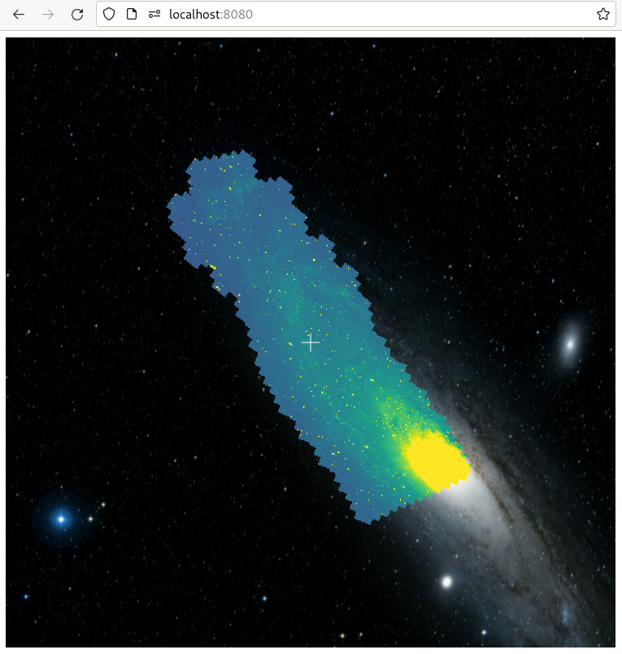

+++
title = "FITS Images"
weight = 700
+++

The previous section briefly introduced the WWT
{{engineapi(p="modules/LayerManager.html",t="LayerManager")}}, which allows you
to add various graphical elements to the WWT view. One important use of this
system, which we’ll cover in this section, is rendering [FITS] imagery.

[FITS]: https://en.wikipedia.org/wiki/FITS

Add the following JavaScript code to your `index.html` file. (If you’re not
following this tutorial linearly, your baseline consists of the the HTML in [A
Basic WWT Window](@/tutorial/basic-window/index.md) and the JavaScript in
[Loading an Image](@/tutorial/add-image/index.md). Changes from this baseline
are subtly highlighted below.)

```js,hl_lines=4 9-23
// ... earlier code omitted ...

function on_wtml_loaded() {
    add_fits();
}

// ... intervening code omitted ...

function add_fits() {
    script_interface.addImageSetLayer(
        "https://github.com/WorldWideTelescope/pywwt-notebooks/raw/master/data/w5.fits",
        "fits", // the format of the data at the specified URL
        "w5.fits", // a name for the layer
        true, // automatically slew to the image center
        on_fits_loaded // callback invoked when the data are loaded
    );
}

function on_fits_loaded(layer) {
    layer.setImageScalePhysical(wwtlib.ScaleTypes.sqrt, 400, 1000);
    layer.set_colorMapperName("plasma");
    layer.set_opacity(0.8);
}

// ... following code omitted ...
</script>
```

If you relaunch your web app, you should see WWT slew to a view of the [W5 star
forming region][w5]:

[w5]: https://en.wikipedia.org/wiki/Westerhout_5


Here,
{{engineapi(p="classes/ScriptInterface.html#addImageSetLayer",t="ScriptInterface.addImageSetLayer()")}}
is a convenience function that helps orchestrate the various tasks associated
with waiting for the data to be fetched, creating the layer, and adding it to
the view. The `on_fits_loaded` callback is passed an
{{engineapi(p="classes/ImageSetLayer-1.html",t="ImageSetLayer")}} instance,
which includes methods for controlling how the FITS data will be mapped to RGB
colors, as shown above. Whenever possible, WWT uses WebGL to RGB-ify and render
the FITS data, so you can adjust display parameters like the image stretch or
opacity and expect performance good enough for interactive use.

<div class="callout callout-note">

As usual, there are higher-level APIs to this functionality:
{{helpersapi(p="classes/WWTInstance.html#addImageSetLayer",t="WWTInstance.addImageSetLayer()")}}
and
{{piniaapi(p="functions/engineStore.html#addImageSetLayer",t="engineStore().addImageSetLayer()")}},
which return promises that resolve to the
{{engineapi(p="classes/ImageSetLayer-1.html",t="ImageSetLayer")}} instance.

</div>

<div class="callout callout-warning">

WWT’s rendering engine cannot handle arbitrary FITS images containing, say,
esoteric WCS definitions. In fact, it is fairly restrictive about what kinds of
images it can display. We argue that this is desirable: the guts of the WWT
engine are *not* the place to maintain code that tries to know how to read every
kind of FITS file that you can throw at it. If you want to visualize arbitrary
FITS images, you should include a code layer that homogenizes the input data to
fit with WWT’s expectations. The Python function
[pywwt.utils.sanitize_image()](https://pywwt.readthedocs.io/en/stable/api/pywwt.utils.sanitize_image.html#pywwt.utils.sanitize_image)
does just that.

</div>

# Large Data Sets

On your first run of this code, there was probably a noticeable pause before WWT
started slewing to the W5 region. This is because the engine had no choice but
to download the entire `w5.fits` file, which weighs in at about 3.8 MiB, before
displaying it. The image-display method shown above can work acceptably for
small FITS data, but won’t scale for large images.

Fortunately, WWT can display large FITS images — in fact, it can display FITS
images of arbitrary size. The tradeoff is that such images need to be
preprocessed into a data format that’s friendly to progressive/streamed
downloading, which FITS most certainly is not. Recognizing this, WWT provides a
suite of tools that aim to make this data processing as easy as possible.

Let’s demonstrate this. Modify your JavaScript code to read as follows:


```js,hl_lines=7 16-34
// ... earlier code omitted ...

function on_ready() {
    console.log("WWT is ready!");
    wwt = wwtlib.WWTControl.singleton;
    script_interface.add_collectionLoaded(on_wtml_loaded);
    script_interface.loadImageCollection("http://data1.wwtassets.org/packages/2021/09_phat_fits/index.wtml");
}

function on_wtml_loaded() {
    add_fits();
}

// ... intervening code omitted ...

function add_fits() {
    script_interface.addImageSetLayer(
        "http://data1.wwtassets.org/packages/2021/09_phat_fits/f475w/{1}/{3}/{3}_{2}.fits",
        "preloaded", // different mode: identify imagery using WTML metadata
        "PHAT F475W",
        true, // automatically slew to the image center
        on_fits_loaded
    );
}

function on_fits_loaded(layer) {
    // For technical reasons, with tiled FITS data we need to wait a frame
    // before applying the scale parameters -- otherwise they'll be overridden
    // by defaults specified in the WTML.
    window.requestAnimationFrame(function () {
        layer.setImageScalePhysical(wwtlib.ScaleTypes.linear, -0.1, 0.4);
    });
    layer.set_colorMapperName("viridis");
}
```

Now we are loading a WTML file that describes a “tiled FITS” dataset, where the
underlying data have been broken into pieces and progressively downsampled into
a “tile pyramid”. For instance, the dataset in this particular example, from the
[PHAT project][phat], represents about 25 GiB of FITS data. And it probably
loaded up faster than the W5 example above! If you zoom in, you’ll see the FITS
data tile in at higher resolutions on-the-fly.

[phat]: https://archive.stsci.edu/hlsp/phat



As mentioned in a previous section, the [toasty] Python library is WWT’s
official tool for generating tiled FITS data from whatever source files you
have. It is thoroughly-tested and can use several forms of parallelism to
accelerate its processing. The [pywwt] package includes support to automatically
invoke Toasty as needed to process data, as well as to make those data available
through a web server so that the WWT frontend can retrieve them. This support
even works in cloud-based Jupyter environments, if the [WWT kernel data
relay][kdr] Jupyter server extension has been installed.

[toasty]: https://toasty.readthedocs.io/
[pywwt]: https://pywwt.readthedocs.io/
[kdr]: https://wwt-kernel-data-relay.readthedocs.io/