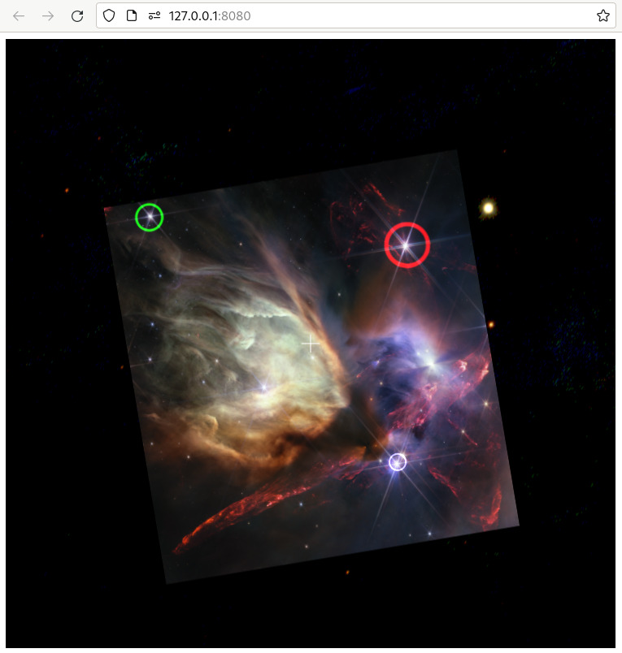

+++
title = "Data Table Layers"
weight = 600
+++

In the previous section, we mentioned that if you want to create a *lot* of
annotations, you might be better served by adding a “spreadsheet layer”. In this
section, we’ll do just that.

Add the following JavaScript code to your `index.html` file. (If you’re not
following this tutorial linearly, your baseline consists of the the HTML in [A
Basic WWT Window](@/tutorial/basic-window/index.md) and the JavaScript in
[Loading an Image](@/tutorial/add-image/index.md). Changes from this baseline
are subtly highlighted below.)

```js,hl_lines=8 13-32
// ... earlier code omitted ...

function on_wtml_loaded() {
    wwt.setForegroundImageByName("Rho Ophiuchi cloud complex");
    script_interface.setForegroundOpacity(100);
    script_interface.add_arrived(on_arrived);
    wwt.gotoRADecZoom(16.442, -24.385, 1.06, false);
    add_spreadsheet();
}

// ... intervening code omitted ...

const csv_data = `\
ra,dec,size,color\r
246.597,-24.350,1,#FF0000\r
246.679,-24.342,2,#00FF00\r
246.600,-24.413,3,#8888FF\r
`;

function add_spreadsheet() {
    const layer = wwtlib.LayerManager.createSpreadsheetLayer(
        "Sky", // the reference frame for these data
        "My Layer", // a name for the layer
        csv_data // the actual data
    );
    layer.set_lngColumn(0); // the 0'th column stores longitudes (RA)
    layer.set_latColumn(1); // the 1st column stores latitudes (Dec)
    layer.set_sizeColumn(2); // etc.
    layer.set_astronomical(true);
    layer.set_plotType(wwtlib.PlotTypes.circle);
    layer.set_markerScale(wwtlib.MarkerScales.screen);
}

// ... following code omitted ...
</script>
```

WWT has a powerful engine for rendering data tables, which internally are
referred to as
{{engineapi(p="classes/SpreadSheetLayer.html",t="SpreadSheetLayers")}}. If you
run your app, you’ll see three points with customized positions, symbol sizes,
and colors:



As shown in this example, you communicate tabular data to the WWT engine simply
as a big string of [CSV] data, separated with Windows-style `\r\n` newlines.
This might seem a bit awkward, but it is easy to assemble such strings, and the
format is fairly efficient. WWT’s WebGL renderer scales such that tables with
tens of thousands of points will generally render with good performance.

[CSV]: https://en.wikipedia.org/wiki/Comma-separated_values

In WWT’s tabular data model, you assign different semantics to different columns
of your dataset. The call to
{{engineapi(p="classes/SpreadSheetLayer.html#set_lngColumn",t="set_lngColumn()")}}
above tells WWT that the 0'th column contains longitudes — or, in a sky context,
right ascension values. You might note, however, that this example does not
explicitly identify the final column as a “color” column, and yet WWT is
rendering the different points with colors corresponding to the column values.
This is because WWT contains logic to guess column semantics based on their
names.

This example references a new class namespace:
{{engineapi(p="modules/LayerManager.html",t="LayerManager")}}. This singleton
object manages visual ”layers” that are combined in the WWT view. All layers
support certain common operations and attributes. For instance, there is a
method {{engineapi(p="classes/Layer.html#set_opacity",t="Layer.set_opacity()")}}
that you can use to make your layer transparent:

```js,hl_lines=4
function add_spreadsheet() {
    // ... earlier code omitted ...
    layer.set_markerScale(wwtlib.MarkerScales.screen);
    layer.set_opacity(0.5);
}
```

<div class="callout callout-warning">

Note that here, opacity values range between 0 and 1, while the engine’s global
“foreground opacity” setting ranges between 0 and 100.

</div>

The most important layers are
{{engineapi(p="classes/SpreadSheetLayer.html",t="SpreadSheetLayer")}},
{{engineapi(p="classes/VoTableLayer-1.html",t="VoTableLayer")}}, and
{{engineapi(p="classes/ImageSetLayer-1.html",t="ImageSetLayer")}}. The
{{engineapi(p="classes/VoTableLayer-1.html",t="VoTableLayer")}} type is almost
identical to
{{engineapi(p="classes/SpreadSheetLayer.html",t="SpreadSheetLayer")}}: as you
might guess, it adds special-case support for parsing and rendering [VOTables].
The engine also supports some more specialized layer types, mainly aimed at the
3D solar system mode, but not all of them are exposed in the TypeScript API
documentation.

[VOTables]: https://www.ivoa.net/documents/VOTable/


# Click-to-Select

The WWT [research app] provides click-to-select functionality for tabular data
layers. It’s worth noting that this support is not (currently) built in to the
engine itself. One reason for this is that selection [UX] design can involve
many tradeoffs, often requiring close alignment between the backend and the
frontend.

[research app]: https://docs.worldwidetelescope.org/research-app/
[UX]: https://en.wikipedia.org/wiki/User_experience

The research app implements its selection scheme by listening for mouse click
events and using the
{{piniaapi(p="functions/engineStore.html#findRADecForScreenPoint",t="findRADecForScreenPoint()")}}
API to map those to sky coordinates. The app has access to the same data table
as the engine, so it can perform a search to see if a click has occurred
sufficiently near one of the points in a table. Region-based selections could be
implemented with similar logic, taking into account the geometry of the region
of interest.
